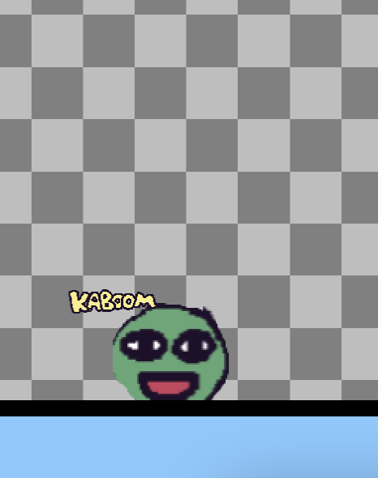

# Entry 2
##### 12/18/23

## Content
After going through the tutorial I started diving deeper into the components of Kaboom that I believe I should learn in order to make my project. Some of these include the many components of body and platforms that have to do with sprites. I learned most of this material through youtube videos and the website itself. Below is an example of a sprite that contains a Body meaning it has physical properties and when creating something like a platform it doesn't go right through it but has a physical body in the computer instead like a character.


```js
onKeyPress("space", () => {
                if (bean.isGrounded()) {
                    bean.jump();
                }
            });
```
The code above of us shows us an example of a conditional in Kaboom which we have learned basic conditionals in just Javascript. If we simply assigned .jump to the sprite bean() then it would have no key assigned to it that allows it to jump and if it did you could spam that key and it would keep jumping. The conditional we makes use of another component "onKeyPress" that allows the parameter of one key in this case space which means spacebar and then the conditional that when the bean is on a solid platform/ground it is allowed to jump restricting it from jumping while already in the air.

I watched a [video on a basic flappy bird tutorial](https://www.youtube.com/watch?v=hgReGsh5xVU&ab_channel=Replit) not to really learn how to make flappy bird but to learn mroe about the compoennts that the video is using. In the video I found out something useful. I found out that instead of using my ide, I can use [replit](https://replit.com/) where kaboom is fully built in whereas using my ide I can only use the cdn link of Kaboomjs which I'm pretty sure is limited. Tinkering a bit on the usage of Kaboom on Replit I found out you can customize, create, and search up sprites making it very accessible for the usage of making a game. 
```js
add([
    sprite("image", {width: width(), height: height()})
]);
```
Before watching the video I was a bit confused on how I use the compoennt width and height like how to assign it and where it's put into this is the code used to create a background. What I didn't understand about width and height is how width: width() and height: height() works without numbers. It's just blank so what does it do? The video explains that if it's blank like that with paranthesis then it takes up the whole screen which is useful for adding something like a background.

After that I watched another [video](https://www.youtube.com/watch?v=4OaHB0JbJDI&t=2623s) on youtube and this time I learned how to add a level. Essentially a level is as the name suggests the level of your game or basically a map layout that you create that include parts of code that can be assigned as blocks/sprites and character placement as shown below.

```js
addLevel([
  "                                  ",
  "                                  ",
  "       @                          ",
  "                 ==               ",
  "                                  ",
  "===========================       "
])
```
In the code above, our sprite/character is defined by the character @ which is placed wherever you want as long as it's in an empty space. Then == or xx being interchangeable as well represents a tile or the ground of your game which can be made into anything you want look wise as you can incorporate the ground tiles with sprites allowing you to make something like a grass block as the tile. In the tile component you can also assign te component "solid" to make it an actual existing ground that a body wouldn't fall through as they technically are just placeholders that take up the layout until you assign something to it.

I believe the next step in my learning process is to continue learning more components and start combining them all together into my end goal of the freedom project and start the game I plan to make through these components I'm learning.

## Takeaways
* Replit is a website that fully supports Kaboom and may be even better to create my code on then in my ide as it has the full build of Kaboom unlike using the cdn link in my ide
* Videos can help you understand concepts as sometimes reading a tutorial or trying to learn it by yourself may not be as efficient. Specifically videos where people make something while coding show us why they use that concept and what it does helping you understand it better which in my case I didn't know how to write out and assign the code for width and height.

[Previous](entry01.md) | [Next](entry03.md)

[Home](../README.md)