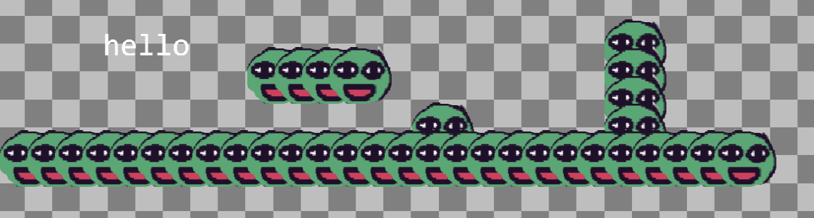

# Entry 3
 2/5/24

# Content 

## Learning My Tool
Watching videos on youtube on basic tutorials on components of Kaboomjs I started noticing an issue occuring throughout my code. Many videos had used the addLevel() component but never worked. An element called solid(); was stated to not be defined whenever I tried creating a level and didn't know why because I even copied the exact same code Kaboom documentation had used. With some research I ended up on this [result](https://www.reddit.com/r/learnjavascript/comments/15t5d9b/kaboomjs_solid_is_not_defined/?rdt=54320) with a user online that has the same issue. Apparently Kaboom recently came out with a [new version](https://kaboomjs.com/blog/3000) of their code: Kaboom3000 and with the addition of this new version they removed and added certain features specifically, removed the element solid() which caused my level to not work. Through this I looked at code that used. Here's a code snippet of the wrong code:

```js
addLevel([
                "                          $",
                "                          $",
                "           $$         =   $",
                "  %      ====         =   $",
                "                      =    ",
                "       ^^      = >    =   &",
                "===========================",
            ], {
                // define the size of tile block
                width: 32,
                height: 32,
                // define what each symbol means, by a function returning a component list (what will be passed to add())
                tiles: {
                    "=": () => [
                        sprite("bean"),
                        area(),
                        solid()
                    ]
                }
            })
```

And here is the snippet of the right one:

```js
addLevel([
                "                          $",
                "                          $",
                "           $$         =   $",
                "  %      ====         =   $",
                "                      =    ",
                "       ^^      = >    =   &",
                "===========================",
            ], {
                tileWidth: 32,
                tileHeight: 32,
                tiles: {
                    "=": () => [
                        sprite("bean"),
                        area(),
                        body({ isStatic: true }),
                    ]
                }
            })
```

This is an example of the map layout where the equal sign is represented by the bean.

Due to this I was able to learn how to use what is probably the most important component necessary in making my game.

## Another component

Another component I've been learning is events specifically collide events. Collide events are used when one element in the game touches another which will then trigger the said event written in the code. I decided to learn this component because for my game it's necessary to be able to "damage" a player when you have a enemey as a npc. Under here is an example of the function being used:

```js
 player.onCollide("enemy", (enemy) => {
                destroy(enemy)
            })
```

Reading it in plain english would show what it does and I've been using this in cases where you control a character that can move with the existence of an "enemy" sprite layed out on the map that you can delete in this case by touching it.

In the future I plan to advance my learning on collision events as a platformer game tends to use many events due to collision of elements in game.

[Previous](entry02.md) | [Next](entry04.md)

[Home](../README.md)